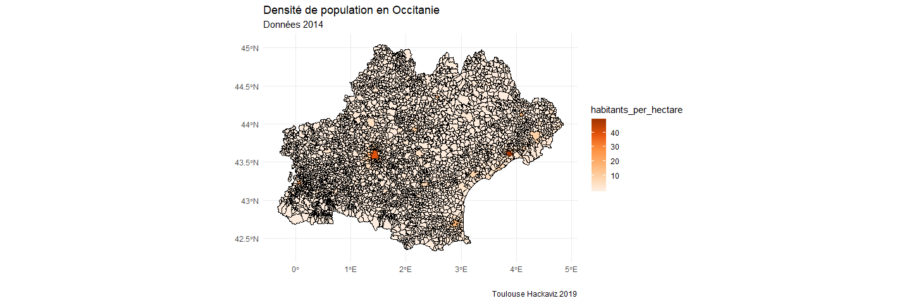

# Infos générales

4516 4516 communes en Occitanie.


Nb de communes par département:


```r
communes %>% 
  count(departement_nom, sort = TRUE) %>% 
  mutate(departement_nom = fct_reorder(departement_nom, n)) %>% 
  
  ggplot(aes(x = departement_nom, y = n)) +
  geom_col() +
  coord_flip() +
  
  labs(title = "Nb de communes par departement en Occitanie",
       subtitle = "",
       x = "", 
       y = "Nombre de communes",
       caption = "Toulouse Hackaviz 2019") +
  my_theme 
```

<!-- -->

Let's try to get a map


```r
map_occitanie +
  geom_point(data = communes,
             aes(x = longitude2, y = latitude2),
             size = 3, alpha = 0.5,
             colour = bar_col1) +
  
  labs(title = "Localisation des communes en Occitanie",
       x = "", y = "",
       caption = "Toulouse Hackaviz 2019") 
```

<!-- -->


```r
map_occitanie +
  geom_point(data = filter(communes, habitants_2014 > 10000),
             aes(x = longitude2, y = latitude2,
                 colour = altitude_moy),
             size = 4) +
  labs(title = "Communes de plus de 10000 habitants en Occitanie",
       subtitle = "",
       x = "", y = "",
       colour = "Altitude moyenne",
       caption = "Toulouse Hackaviz 2019")
```

<!-- -->


```r
map_occitanie +
  geom_point(data = filter(communes, 
                           habitants_2014 < 3000),
             aes(x = longitude2, y = latitude2,
                 colour = altitude_moy),
             size = 3) +
  labs(title = "Communes de moins de 3000 habitants en Occitanie",
       subtitle = "",
       x = "", y = "",
       colour = "Altitude moyenne",
       caption = "Toulouse Hackaviz 2019")
```

<!-- -->

```r
map_occitanie +
  geom_point(data = filter(communes, 
                           habitants_2014 < 500),
             aes(x = longitude2, y = latitude2,
                 colour = altitude_moy),
             size = 3) +
  labs(title = "Communes de moins de 500 habitants en Occitanie",
       subtitle = "",
       x = "", y = "",
       colour = "Altitude moyenne",
       caption = "Toulouse Hackaviz 2019")
```

<!-- -->


```r
map_occitanie_communes +
 aes(fill = pop_classification) +
  
  labs(title   = "Classification des communes d'Occitanie par taille de population",
       subtitle = "Nb d'habitants en 2014",
       x = "", y = "",
       caption = "Toulouse Hackaviz 2019")
```

<!-- -->


```r
map_occitanie_communes +
 aes(fill = type_commune) +
  
  labs(title   = "Classification de la taille des communes en Occitanie",
       subtitle = "Basée sur le nombre d'habitants en 2014",
       x = "", y = "",
       caption = "Toulouse Hackaviz 2019") +
  scale_fill_brewer(type = "seq",
                       palette = "Oranges",
                       direction = 1)
```

<!-- -->


# Superficie communes


```r
communes %>% 
  group_by(departement_nom) %>% 
  summarise(moy = mean(superficie),
            var = var(superficie),
            sd  = sd(superficie))
```

```
## # A tibble: 13 x 4
##    departement_nom       moy      var    sd
##    <chr>               <dbl>    <dbl> <dbl>
##  1 ARIEGE              1482. 3236742. 1799.
##  2 AUDE                1453. 1618440. 1272.
##  3 AVEYRON             2919. 3791740. 1947.
##  4 GARD                1664. 2788367. 1670.
##  5 GERS                1362. 1295035. 1138.
##  6 HAUTE-GARONNE       1081.  993203.  997.
##  7 HAUTES-PYRENEES      942. 2602439. 1613.
##  8 HERAULT             1818. 2022045. 1422.
##  9 LOT                 1540. 1019500. 1010.
## 10 LOZERE              2824. 3576694. 1891.
## 11 PYRENEES-ORIENTALES 1836. 2502759. 1582.
## 12 TARN                1796. 3034937. 1742.
## 13 TARN-ET-GARONNE     1913. 3104905. 1762.
```


```r
communes %>% 
  ggplot(aes(x = superficie)) +
  geom_histogram() +
  facet_wrap(~departement_nom, scales = "free") +
  
  labs(title = "Superficie des communes d'Occitanie",
       x = "Aire en hectares",
       y = "Nb de communes")
```

```
## `stat_bin()` using `bins = 30`. Pick better value with `binwidth`.
```

<!-- -->


# Habitants


```r
communes %>% 
  group_by(departement_nom) %>% 
  summarise(moy = mean(habitants_2014),
            var = var(habitants_2014),
            sd  = sd(habitants_2014))
```

```
## # A tibble: 13 x 4
##    departement_nom       moy        var     sd
##    <chr>               <dbl>      <dbl>  <dbl>
##  1 ARIEGE               460.   1492644.  1222.
##  2 AUDE                 838.  12393244.  3520.
##  3 AVEYRON              974.   5210919.  2283.
##  4 GARD                2085.  72699215.  8526.
##  5 GERS                 413.   1527401.  1236.
##  6 HAUTE-GARONNE       2237. 377672610. 19434.
##  7 HAUTES-PYRENEES      485.   4540197.  2131.
##  8 HERAULT             3229. 249226168. 15787.
##  9 LOT                  533.   1690676.  1300.
## 10 LOZERE               434.   1070144.  1034.
## 11 PYRENEES-ORIENTALES 2063.  68359119.  8268.
## 12 TARN                1201.  15436420.  3929.
## 13 TARN-ET-GARONNE     1295.  19927852.  4464.
```


```r
communes %>% 
  ggplot(aes(x = habitants_2014)) +
  geom_histogram() +
  facet_wrap(~departement_nom, scales = "free") +
  labs(title = "Distribution de la population en Occitanie",
       subtitle = "Données de 2014",
       x = "Nombre d'habitants",
       y = "Nombre de communes")
```

```
## `stat_bin()` using `bins = 30`. Pick better value with `binwidth`.
```

<!-- -->


```r
map_occitanie +
  geom_point(data = communes,
             aes(x = longitude2, y = latitude2,
                 colour = log_habitants_2014),
             size = 3, alpha = 0.7) +
  labs(title = "Nombre d'habitants par commune",
       subtitle = "Données 2014",
        x = "", y = "",
       colour = "Log nb habitants",
       caption = "Toulouse Hackaviz 2019") +
  scale_colour_gradient(low = gradient_low,
                        high = gradient_high)
```

<!-- -->


```r
map_occitanie_communes +
  aes(fill = log_habitants_2014) +
  
  labs(title   = "Nb d'habitants par commune en Occitanie",
       subtitle = "Nb d'habitants en 2014",
        x = "", y = "",
       fill = "Log nb habitants",
       caption = "Toulouse Hackaviz 2019") +
   scale_fill_gradient(low = gradient_low,
                        high = gradient_high)
```

<!-- -->

```r
  # scale_fill_distiller(type = "seq",
  #                      palette = "Oranges",
  #                      direction = 1)
```


## Proportion d'habitants actifs

## Weird cases

Il y a quatres communes avec plus d'habitants actifs que d'habitants en 2014. La grosse différence est pour CAUNNETTE sur Lauquet (6 -> 23, ça fait une sacrée différence...).


```r
communes %>% 
  filter(prop_habitants_actifs_2014 > 1) %>% 
  select(commune, habitants_2014, personnes_actives_2014)
```

```
## # A tibble: 4 x 3
##   commune              habitants_2014 personnes_actives_2014
##   <chr>                         <dbl>                  <dbl>
## 1 CAUNETTE SUR LAUQUET              6                     23
## 2 TREBONS DE LUCHON                 4                      5
## 3 OURDE                            34                     35
## 4 SAINT LANNE                     130                    149
```

Et il y a des communes sans habitants actifs...


```r
communes %>% 
  filter(prop_habitants_actifs_2014 == 0) %>% 
  select(commune, habitants_2014, personnes_actives_2014)
```

```
## # A tibble: 30 x 3
##    commune              habitants_2014 personnes_actives_2014
##    <chr>                         <dbl>                  <dbl>
##  1 GENAT                            21                      0
##  2 ILLIER ET LARAMADE               23                      0
##  3 LAPEGE                           27                      0
##  4 ORUS                             26                      0
##  5 LE PLA                           55                      0
##  6 CAMPAGNA DE SAULT                18                      0
##  7 CLERMONT SUR LAUQUET             27                      0
##  8 LA FAJOLLE                       10                      0
##  9 FONTANES DE SAULT                 5                      0
## 10 MASSAC                           30                      0
## # ... with 20 more rows
```

```r
# Where?
sf_communes %>% 
  ggplot() +
  geom_sf(colour = "black", fill = "white") +
  coord_sf(crs = 4326, datum = sf::st_crs(4326))  +
  theme_minimal() +
  geom_sf(data = filter(sf_communes,
                        prop_habitants_actifs_2014 == 0),          fill = "red") +
  labs(title   = "Les communes d'occitanie",
       subtitle = "Nb d'habitants",
       caption = "Toulouse Hackaviz 2019")
```

```
## Coordinate system already present. Adding new coordinate system, which will replace the existing one.
```

<!-- -->


# Distribution


```r
communes %>% 
  filter(prop_habitants_actifs_2014 <= 1 ) %>% 
  ggplot(aes(x = prop_habitants_actifs_2014)) +
  geom_histogram() +
  facet_wrap(~departement_nom, scales = "free") +
  labs(title = "Distribution du nombre d'habitants actifs par commune",
       subtitle = "Données 2014 en Occitanie")
```

```
## `stat_bin()` using `bins = 30`. Pick better value with `binwidth`.
```

<!-- -->


```r
communes %>% 
  filter(prop_habitants_actifs_2014 <= 1 ) %>% 
  
  ggplot(aes(x = prop_habitants_actifs_2014,
             y = departement_nom,
             fill = ..x..)) +
  geom_density_ridges_gradient(scale = 2) +
 
   theme_ridges(grid = FALSE, 
               center_axis_labels = TRUE) +
    scale_fill_gradient(low = gradient_low,
                        high = gradient_high) +
  labs(title = "Proportion d'habitants actifs par département",
       subtitle = "Occitanie, 2014",
       x = "Proportion d'habitants actifs",
       y = "",
       fill = "",
       caption = "Toulouse Hackaviz 2019")
```

```
## Picking joint bandwidth of 0.0222
```

<!-- -->


Comment est-ce que le nombre de personnes actives est correlé avec le nombre d'habitants ?
La variance augmente avec le nombre d'habitants, mais les deux sont très bien correlées.


```r
communes %>% 
  ggplot(aes(x = habitants_2014, 
             y = personnes_actives_2014)) +
  geom_point() +
  labs(title = "Habitants et habitants actifs 2014",
       caption = "Toulouse Hackaviz 2019") +
  geom_smooth()
```

```
## `geom_smooth()` using method = 'gam' and formula 'y ~ s(x, bs = "cs")'
```

<!-- -->

```r
communes %>% 
  filter(habitants_2014 < 20000) %>% 
  ggplot(aes(x = habitants_2014, 
             y = personnes_actives_2014)) +
  geom_point() +
  geom_smooth() +
  labs(title = "Habitants et habitants actifs 2014",
       subtitle = "Communes de moins de 20 000 habitants",
       x = "Nb habitants",
       y = "Nb personnes actives",
       caption = "Toulouse Hackaviz 2019")
```

```
## `geom_smooth()` using method = 'gam' and formula 'y ~ s(x, bs = "cs")'
```

<!-- -->

Pas la peine de se prendre trop la tête là dessus.

Une bonne carte des habitants actifs fera l'affaire : 


```r
map_occitanie_communes +
 geom_sf(data = filter(sf_communes, 
                    prop_habitants_actifs_2014 <= 1),
         aes(fill = prop_habitants_actifs_2014)) +
  
  labs(title   = "Nombre d'habitants actifs par commune en Occitanie",
       subtitle = "Données : 2014",
       x = "", y = "",
       caption = "Toulouse Hackaviz 2019") +
  scale_fill_distiller(type = "seq",
                       palette = "Oranges",
                       direction = 1)
```

```
## Coordinate system already present. Adding new coordinate system, which will replace the existing one.
```

<!-- -->


# Peuplement et taille

## Habitants et superficie


```r
communes %>% 
  ggplot(aes(x = superficie, y = habitants_2014)) +
  geom_point() +
  
  labs(title   = "Superficie et nb d'habitants",
       subtitle = "All data, 2014",
       x = "Superficie", 
       y = "Nb habitants",
       caption = "Toulouse Hackaviz 2019")
```

<!-- -->


```r
communes %>% 
  ggplot(aes(x = superficie, y = habitants_2014)) +
  geom_point() +
  geom_smooth() +
  facet_wrap(~pop_classification, scales = "free") +
  
  labs(title   = "Superficie et nb d'habitants",
       subtitle = "All data, 2014",
       x = "Superficie", 
       y = "Nb habitants",
       caption = "Toulouse Hackaviz 2019")
```

```
## `geom_smooth()` using method = 'loess' and formula 'y ~ x'
```

```
## Warning in simpleLoess(y, x, w, span, degree = degree, parametric =
## parametric, : span too small. fewer data values than degrees of freedom.
```

```
## Warning in simpleLoess(y, x, w, span, degree = degree, parametric =
## parametric, : pseudoinverse used at 9528.4
```

```
## Warning in simpleLoess(y, x, w, span, degree = degree, parametric =
## parametric, : neighborhood radius 4064.6
```

```
## Warning in simpleLoess(y, x, w, span, degree = degree, parametric =
## parametric, : reciprocal condition number 0
```

```
## Warning in simpleLoess(y, x, w, span, degree = degree, parametric =
## parametric, : There are other near singularities as well. 1.5529e+007
```

```
## Warning in predLoess(object$y, object$x, newx = if
## (is.null(newdata)) object$x else if (is.data.frame(newdata))
## as.matrix(model.frame(delete.response(terms(object)), : span too small.
## fewer data values than degrees of freedom.
```

```
## Warning in predLoess(object$y, object$x, newx = if
## (is.null(newdata)) object$x else if (is.data.frame(newdata))
## as.matrix(model.frame(delete.response(terms(object)), : pseudoinverse used
## at 9528.4
```

```
## Warning in predLoess(object$y, object$x, newx = if
## (is.null(newdata)) object$x else if (is.data.frame(newdata))
## as.matrix(model.frame(delete.response(terms(object)), : neighborhood radius
## 4064.6
```

```
## Warning in predLoess(object$y, object$x, newx = if
## (is.null(newdata)) object$x else if (is.data.frame(newdata))
## as.matrix(model.frame(delete.response(terms(object)), : reciprocal
## condition number 0
```

```
## Warning in predLoess(object$y, object$x, newx = if
## (is.null(newdata)) object$x else if (is.data.frame(newdata))
## as.matrix(model.frame(delete.response(terms(object)), : There are other
## near singularities as well. 1.5529e+007
```

```
## Warning in simpleLoess(y, x, w, span, degree = degree, parametric =
## parametric, : span too small. fewer data values than degrees of freedom.
```

```
## Warning in simpleLoess(y, x, w, span, degree = degree, parametric =
## parametric, : at 6784.6
```

```
## Warning in simpleLoess(y, x, w, span, degree = degree, parametric =
## parametric, : radius 2156.7
```

```
## Warning in simpleLoess(y, x, w, span, degree = degree, parametric =
## parametric, : all data on boundary of neighborhood. make span bigger
```

```
## Warning in simpleLoess(y, x, w, span, degree = degree, parametric =
## parametric, : pseudoinverse used at 6784.6
```

```
## Warning in simpleLoess(y, x, w, span, degree = degree, parametric =
## parametric, : neighborhood radius 46.44
```

```
## Warning in simpleLoess(y, x, w, span, degree = degree, parametric =
## parametric, : reciprocal condition number 1
```

```
## Warning in simpleLoess(y, x, w, span, degree = degree, parametric =
## parametric, : at 16165
```

```
## Warning in simpleLoess(y, x, w, span, degree = degree, parametric =
## parametric, : radius 2156.7
```

```
## Warning in simpleLoess(y, x, w, span, degree = degree, parametric =
## parametric, : all data on boundary of neighborhood. make span bigger
```

```
## Warning in simpleLoess(y, x, w, span, degree = degree, parametric =
## parametric, : There are other near singularities as well. 2156.7
```

```
## Warning in simpleLoess(y, x, w, span, degree = degree, parametric =
## parametric, : zero-width neighborhood. make span bigger

## Warning in simpleLoess(y, x, w, span, degree = degree, parametric =
## parametric, : zero-width neighborhood. make span bigger
```

```
## Warning: Computation failed in `stat_smooth()`:
## NA/NaN/Inf dans un appel à une fonction externe (argument 5)
```

```
## Warning in simpleLoess(y, x, w, span, degree = degree, parametric =
## parametric, : span too small. fewer data values than degrees of freedom.
```

```
## Warning in simpleLoess(y, x, w, span, degree = degree, parametric =
## parametric, : at 5681.5
```

```
## Warning in simpleLoess(y, x, w, span, degree = degree, parametric =
## parametric, : radius 929.34
```

```
## Warning in simpleLoess(y, x, w, span, degree = degree, parametric =
## parametric, : all data on boundary of neighborhood. make span bigger
```

```
## Warning in simpleLoess(y, x, w, span, degree = degree, parametric =
## parametric, : pseudoinverse used at 5681.5
```

```
## Warning in simpleLoess(y, x, w, span, degree = degree, parametric =
## parametric, : neighborhood radius 30.485
```

```
## Warning in simpleLoess(y, x, w, span, degree = degree, parametric =
## parametric, : reciprocal condition number 1
```

```
## Warning in simpleLoess(y, x, w, span, degree = degree, parametric =
## parametric, : at 11839
```

```
## Warning in simpleLoess(y, x, w, span, degree = degree, parametric =
## parametric, : radius 929.34
```

```
## Warning in simpleLoess(y, x, w, span, degree = degree, parametric =
## parametric, : all data on boundary of neighborhood. make span bigger
```

```
## Warning in simpleLoess(y, x, w, span, degree = degree, parametric =
## parametric, : There are other near singularities as well. 929.34
```

```
## Warning in simpleLoess(y, x, w, span, degree = degree, parametric =
## parametric, : zero-width neighborhood. make span bigger

## Warning in simpleLoess(y, x, w, span, degree = degree, parametric =
## parametric, : zero-width neighborhood. make span bigger
```

```
## Warning: Computation failed in `stat_smooth()`:
## NA/NaN/Inf dans un appel à une fonction externe (argument 5)
```

<!-- -->

Si on enlève les communes super ultra peuplées


```r
communes %>% 
  filter(habitants_2014 < 100000) %>% 
  
  ggplot(aes(x = superficie, y = habitants_2014)) +
  geom_point() +
  geom_smooth() +
  
  labs(title   = "Superficie et nb d'habitants",
       subtitle = "Communes de moins de 100 000 habitants (2014)",
       x = "Superficie", 
       y = "Nb habitants",
       caption = "Toulouse Hackaviz 2019")
```

```
## `geom_smooth()` using method = 'gam' and formula 'y ~ s(x, bs = "cs")'
```

<!-- -->

Le signal est pas ultra clair.


## Habitants actifs 2014 et superficie


```r
communes %>% 
  ggplot(aes(x = superficie, y = personnes_actives_2014)) +
  geom_point() +
  
  labs(title   = "Superficie et nb d'habitants actifs",
       subtitle = "All data, 2014",
       x = "Superficie", 
       y = "Nb habitants actifs",
       caption = "Toulouse Hackaviz 2019")
```

<!-- -->

Si on enlève les communes super ultra peuplées


```r
communes %>% 
  filter(personnes_actives_2014 < 100000) %>% 
  
  ggplot(aes(x = superficie, y = personnes_actives_2014)) +
  geom_point() +
  geom_smooth() +
  
  labs(title   = "Superficie et nb d'habitants actifs",
       subtitle = "Communes de moins de 100 000 habitants actifs (2014)",
       x = "Superficie", 
       y = "Nb habitants",
       caption = "Toulouse Hackaviz 2019")
```

```
## `geom_smooth()` using method = 'gam' and formula 'y ~ s(x, bs = "cs")'
```

<!-- -->

Signal pas ultra clair. Je pense que c'est parce que l'on a des petites communes peu peuplées, des petites communes très peuplées, et des grandes communes très peuplées (agglo) et des grandes communes peu peuplées (ex : dans les Pyrénées).


## Nb habitants per hectare

Pour résummer ce que je viens de regarder, je fais une variable habitants par hectare => densité de population.


```r
communes %>% 
  group_by(departement_nom) %>% 
  summarise(densite_moyenne_2014 = mean(habitants_per_hectare)) %>% 
  mutate(departement_nom = fct_reorder(departement_nom, densite_moyenne_2014)) %>% 
  ggplot(aes(x = departement_nom, y = densite_moyenne_2014)) +
  geom_col() +
  coord_flip() +
  
  labs(title   = "Densité de population",
       subtitle = "All data, 2014",
       y = "Nb habitants par hectare", 
       x = "",
       caption = "Toulouse Hackaviz 2019")
```

<!-- -->

Toutes communes confondues, l'Herault a la plus forte densité de pop per commune, suivi de la Haute Garonne.


```r
communes %>% 
  group_by(departement_nom, pop_classification) %>% 
  summarise(densite_moyenne_2014 = mean(habitants_per_hectare)) %>% 
  ungroup() %>% 
  mutate(departement_nom = fct_reorder(departement_nom, 
                                       densite_moyenne_2014)) %>% 
  ggplot(aes(x = departement_nom, y = densite_moyenne_2014)) +
  geom_col() +
  coord_flip() +
  facet_wrap(~pop_classification) +
  
  labs(title   = "Densité de population",
       subtitle = "Par taille de commune, 2014",
       y = "Nb habitants par hectare", 
       x = "",
       caption = "Toulouse Hackaviz 2019")
```

<!-- -->


```r
map_occitanie_communes +
  aes(fill = habitants_per_hectare)  +
  
  labs(title   = "Densité de population en Occitanie",
       subtitle = "Données 2014",
       x = "", y = "",
       caption = "Toulouse Hackaviz 2019") +
  
  scale_fill_distiller(type = "seq",
                       palette = "Oranges",
                       direction = 1)
```

<!-- -->

# Peuplement et altitude


```r
communes %>% 
  ggplot(aes(x = altitude_moy, y = habitants_2014)) +
  geom_point() +
  
  labs(title   = "Altitude et nb d'habitants",
       subtitle = "All data, 2014",
       x = "Altitude moyenne", 
       y = "Nb habitants",
       caption = "Toulouse Hackaviz 2019")
```

<!-- -->

Bon, j'en ai marre, je crée des classes de population et d'altitude.


```r
communes %>% 
   ggplot(aes(x = altitude_moy, y = habitants_2014)) +
  geom_point() +
  facet_wrap(~pop_classification, scales = "free") +
  
  labs(title   = "Altitude et nb d'habitants",
       subtitle = "All data, 2014",
       x = "Altitude moyenne", 
       y = "Nb habitants",
       caption = "Toulouse Hackaviz 2019")
```

<!-- -->


# Ménages 2014


```r
communes %>%
  ggplot(aes(x = menages_2014)) +
  geom_histogram()
```

```
## `stat_bin()` using `bins = 30`. Pick better value with `binwidth`.
```

<!-- -->

```r
communes %>%
  filter(menages_2014 < 1000) %>% 
  ggplot(aes(x = menages_2014)) +
  geom_histogram()
```

```
## `stat_bin()` using `bins = 30`. Pick better value with `binwidth`.
```

<!-- -->


Communes avec zero ménages. Pourquoi ? Il y en a pas mal quand même... (824). Je propose de laisser tomber la mesure des ménages pour la suite, elle a l'air zarb.


```r
communes %>% 
  filter(menages_2014 == 0) %>% 
  select(commune, menages_2014, habitants_2014, personnes_actives_2014)
```

```
## # A tibble: 824 x 4
##    commune            menages_2014 habitants_2014 personnes_actives_2014
##    <chr>                     <dbl>          <dbl>                  <dbl>
##  1 AIGUES JUNTES                 0             58                     36
##  2 ALLIAT                        0             55                     20
##  3 ALLIERES                      0             71                     35
##  4 ANTRAS                        0             61                     10
##  5 APPY                          0             29                     18
##  6 ARABAUX                       0             60                     21
##  7 ARRIEN EN BETHMALE            0            108                     32
##  8 ARROUT                        0             80                     20
##  9 ARTIGUES                      0             52                     10
## 10 AUCAZEIN                      0             64                     28
## # ... with 814 more rows
```


## Taille des ménages

Taille des ménages en Occitanie


```r
mean(communes$taille_menage_2014, na.rm = TRUE)
```

```
## [1] 2.408581
```

Peu de variation par département.


```r
communes %>% 
  group_by(departement_nom) %>% 
  summarise(menage_moy = mean(taille_menage_2014, na.rm = TRUE)) %>% 
  ungroup() %>% 
  mutate(departement_nom  = fct_reorder(departement_nom,
                                       menage_moy)) %>% 
  ggplot(aes(x = departement_nom, y = menage_moy)) +
  geom_col() +
  coord_flip() +
  labs(title = "Taille moyenne des ménages en Occitanie",
       subtitle = "Moyenne départementale, données 2014",
       x = "",
       y = "Taille ménage moyen")
```

<!-- -->

Par nb d'habitants de commune


```r
communes %>% 
  group_by(pop_classification) %>% 
  summarise(menage_moy = mean(taille_menage_2014, na.rm = TRUE)) %>% 
  ggplot(aes(x = pop_classification, y = menage_moy)) +
  geom_col() +
  coord_flip() +
  labs(title = "Taille moyenne des ménages en Occitanie",
       subtitle = "Moyenne par taille d'agglo, données 2014",
       x = "",
       y = "Taille ménage moyen")
```

```
## Warning: Removed 1 rows containing missing values (position_stack).
```

<!-- -->


```r
communes %>% 
  group_by(type_commune) %>% 
  summarise(menage_moy = mean(taille_menage_2014, 
                              na.rm = TRUE)) %>% 
  ggplot(aes(x = type_commune, y = menage_moy)) +
  geom_col() +
  coord_flip() +
   labs(title = "Taille moyenne des ménages en Occitanie",
       subtitle = "Moyenne par type d'agglo, données 2014",
       x = "",
       y = "Taille ménage moyen")
```

<!-- -->

Il y a un petit creux pour les villes moyennes

Bon, on plote ça et on laisse tomber cette variable.


```r
map_occitanie_communes +
  aes(fill = taille_menage_2014)  +
  
  labs(title   = "Taille moyenne des ménages en Occitanie",
       subtitle = "Données de 2014",
       x = "", y = "",
       caption = "Toulouse Hackaviz 2019") +
  
  scale_fill_distiller(type = "seq",
                       palette = "Oranges",
                       direction = 1)
```

<!-- -->


