# Emploi

Explorons l'attractivité des communes en terme d'emplois.

## Données brutes

Par département.
La Haute Garonne est largement en tête, suivie de l'Herault. Pas surprenant, avec Toulouse et Montepllier.

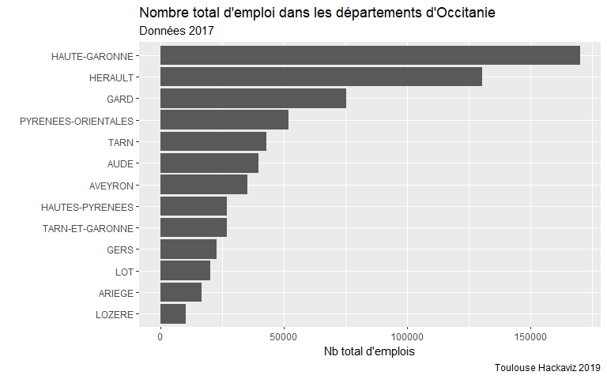<!-- -->

Quelles sont les villes attractives ?

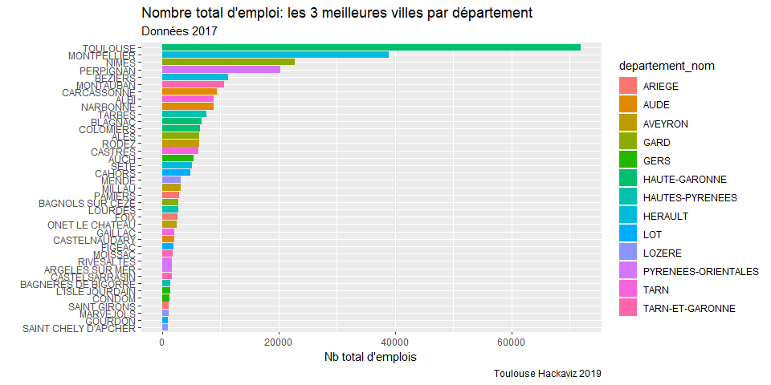<!-- -->

## Par nb personnes actives

Attention, la mesure n'est pas exacte, on divise le nombre d'emploi en 2017 par le nombre de personnes actives en 2015. je peux pas faire mieux. Après, ça doit pas changer tant que ça en deux ans, si ?

Bon, c'est bien, on sait qu'il y a plein d'emploi à Toulouse, et encore un peu à Montpellier, mais ça fait cmbien d'emplois par personne "active" ?

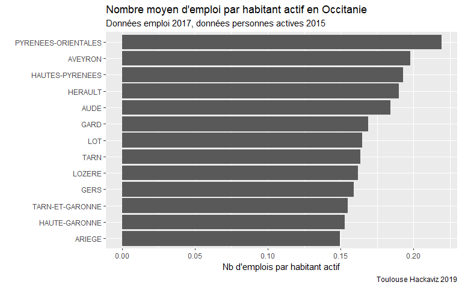<!-- -->

Distribution (en enlevant GERM, où il y a 28 emploi par habitant actif...wtf?)

```
## `stat_bin()` using `bins = 30`. Pick better value with `binwidth`.
```

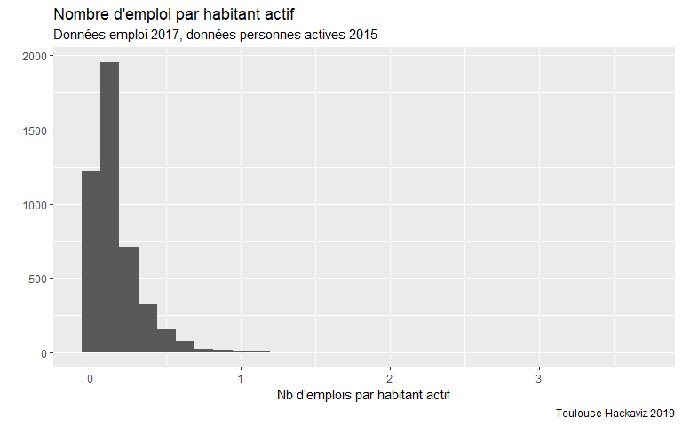<!-- -->

Quelles sont les 10 meilleures villes ?


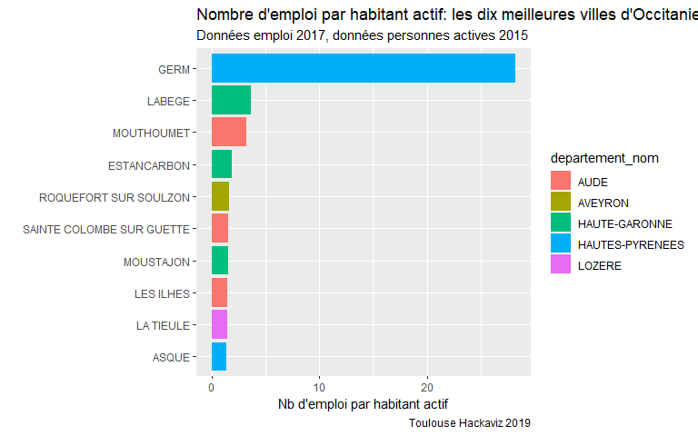<!-- -->


Quelles sont les trois meilleurs villes par département ?


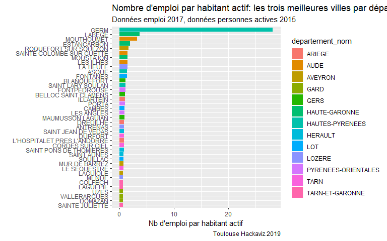<!-- -->

Wow, ce n'est pas du tout la même image. Je reconnais quelques noms, que j'associe à des villes en périphérie de grosse agglo (Labège, St Jean de Védas), et où y a des zones d'activité et des centres commerciaux. Je ne sais pas pour les autres.

En enlevant GERM (28), LABEGE (3.6) et MONTHOUMET (3.2).


```
## Coordinate system already present. Adding new coordinate system, which will replace the existing one.
```

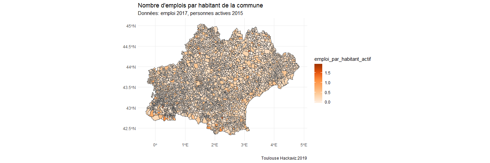<!-- -->

I am a bit surpised. I can see the towns around Toulouse (toutes les zones d'activité) mais c'est moins clair en périphérie de Montpellier. Il y a les villes dans les Pyrénées. Ca peut refleter les stations de ski ? Pareil pour les villes sur les côtes. Mais la variation dans le Haut Languedoc et la montagne noire, je ne l'explique pas.

**Conclusion**

Les communes avec le plus d'emplois sont les grandes agglomérations. Mais les communes avec le plus d'emploi par habitant actif sont des communes sur le littoral, dans les montagnes, et en périphérie des grandes agglomérations.


# Considérations générales sur les flux

**Questions**

Quelles sont les communes les plus attractives ? Quelles sont les communes dortoirs ? Où se situent ces communes ? Comment ça varie au fil des années ?

Il y a plusieurs manières de regarder ça. 

En chiffres bruts, on s'attend que les grosses agglo attirent plus, parce qu'il y a plus d'emploi, et que les communes avoisinantes aient plus de flux sortants.

Donc on veut aussi pondérer ces flux. Il y a plusieurs manières que l'on peut envisager. On peut pondérer les flux par :  

- le nombre d'habitants / nb d'actifs : donne une idée de à quel point la population qui vient travailler est plus grande que la population qui habite ici / la population travaillante. Et respectivement pour la sortie.
- on peut pondérer par le nombre d'mploi que la commune offre. Quelle part des gens employés vient de l'extérieur ?
- On peut faire le ratio entre flux entrant et flux sortant. Ou le contraire. Comment gère-t-on ceux qui travailent en intra commune ?
- sortant / intra : combien la commune arrive à garder pour elle ?

En 2009 et 2014 on n'a pas les différences voiture et sans voiture. On va commencer par là.


# 2009

En 2009, j'ai 

## Proportion sortants

Exploration des flux rapportés à la population active de la commune. En d'autres termes, si la proportion de sortants par rapport à la population active est haute, ça veut dire qu'une grosse partie de la force active quitte la commune pour aller travailler ailleurs. Une cité dortoir, quoi.


Bon, déjà est-ce qu'on est sur que intra + sortant = actif ?


```
## [1] "Mean relative difference: 0.001221851"
```
Ca a pas l'air top horrible.


On a des communes avec zero sortants. Ok, fair enough.
On a aussi des communes avec 100% de sortants. Fair enough.
Et on a 10 communes avec zero actifs, donc la division a fait des NaNs. Normal.


```
## `stat_bin()` using `bins = 30`. Pick better value with `binwidth`.
```

```
## Warning: Removed 20 rows containing non-finite values (stat_bin).
```

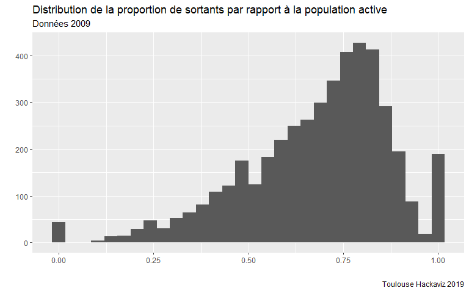<!-- -->


```
## `stat_bin()` using `bins = 30`. Pick better value with `binwidth`.
```

```
## Warning: Removed 20 rows containing non-finite values (stat_bin).
```

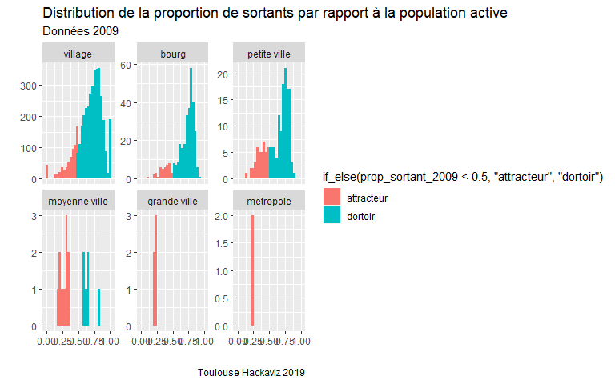<!-- -->

Bon, c'est dur de comparer, parce qu'il y a deux métropoles, cinq grandes villes et 16 moyennes villes, mais les catégories en dessous on clairement un problème de perte d'actifs qui vont travailler ailleurs. Enfin, un problème, j'en sais rien, s'il n'y a pas d'emploi, c'est pas une mauvaise chose.

On dirait que pour les moyennes villes la distribution est bimodale. Je parie que c'est la différence entre les comunes limitrophes de Toulouse et celles qui sont éloignées d'un grand pole (qui **sont** le grand pole du coin). Let's check.

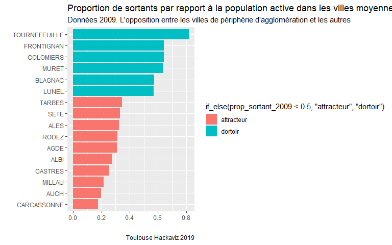<!-- -->

Well, c'était pas mauvais comme hypothèse : les communes qui attirent le plus sont celles qui sont leur propore pôle : Carcassonne, Millau, Auch, Castres, Albi... Alors que celles qui perdent le plus sont celles qui sont accolées à de grandes agglomérations.

Je suis sûre que c'est pareil pour les petites villes, mais là on va pas s'en sortir en les filtrant. on va faire une belle carte. Enfin, une carte déjà.

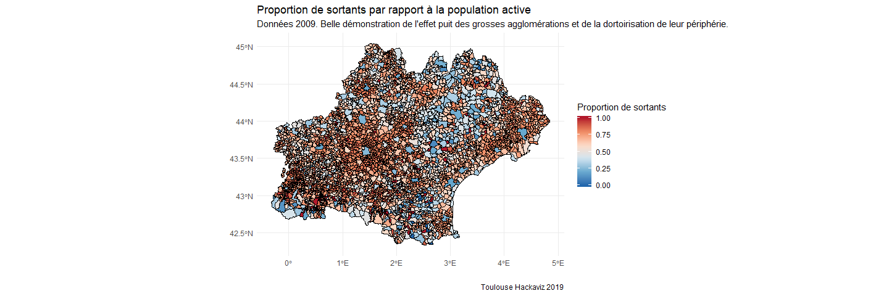<!-- -->

C'est une belle carte !
